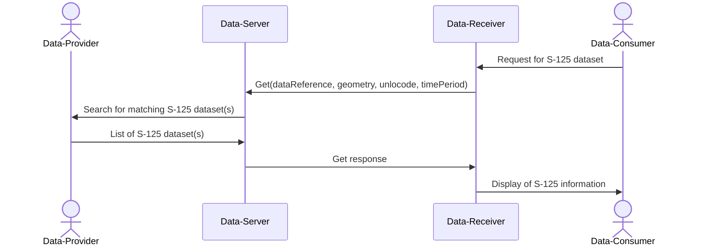
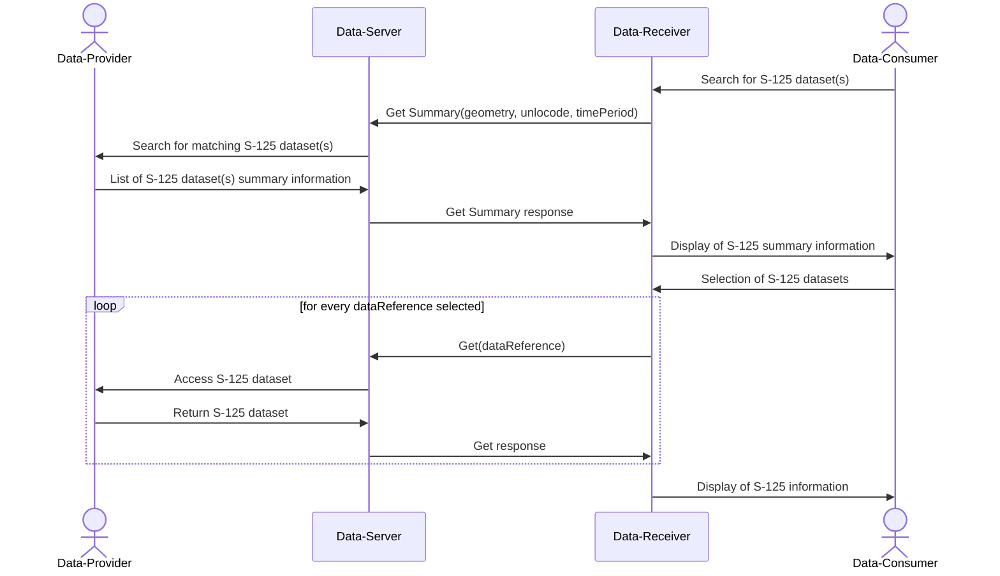
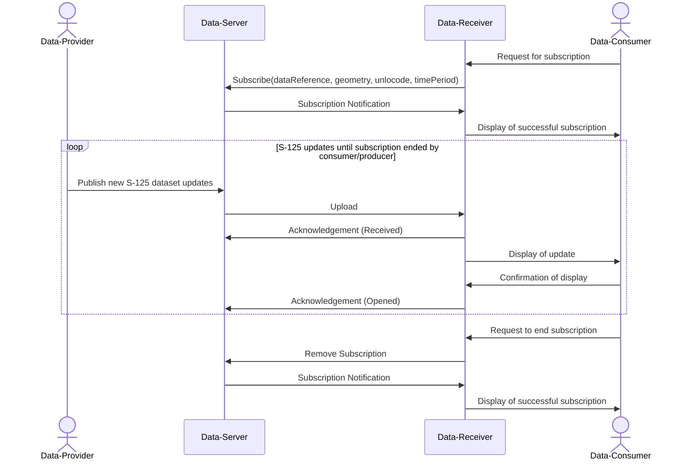

\pagebreak

# Service Dynamic Behaviour {#sec:service-dynamic-behaviour}

In the following diagrams and descriptions, the communication between the vessel’s onboard systems and its SECOM service is out of scope for the purposes of this design.

Similarly, the communication and interfaces between the service and the on-board ship system is out of scope of this design.

## Generic sequence for signatures {#sec:dynamic_behaviour_signature_sequence}

This sequence assumes the following actors:

Data Provider &rarr; Data Server &rarr; Data Receiver &rarr; Data Consumer

The sequence describes the data from its source through transport using SECOM to the end-user.

Data Provider preparation:

* The data provider must have an identity in trusted PKI system
* The data provider creates a private-public key pair
* The data provider sends the public key to PKI system to get it signed and connected to a specific identity/identifier in the PKI system (Certificate Signing Request)

Data Sender preparation:

* The data sender must have an identity in trusted PKI system
* The data sender creates a private-public key pair
* The data sender sends the public key to PKI system to get it signed and connected to a specific identity/identifier in the PKI system (Certificate Signing Request)

Data Provider and Data Sender:

* The data provider selects identifier and certificate to use for the data signing
* The data provider creates a signature for the data
* The data provider transfers the data with its signature to the data sender.
* The data sender protects the data transferring by the selected communication mechanism, e.g. SECOM. SECOM Upload wraps the data, the signature and metadata into an envelope. The envelope is signed by the data sender.
* The data sends contacts the data receiver and transfers the data

Data Receiver and Data Consumer:

* The data receiver receives the transferred object with envelope. The envelope signature is verified.
* The data receiver forwards the data and data signature to the data consumer
* The data consumer verifies the data signature

## Client-initiated Retrieval of AtoN Information {#sec:dynamic_behaviour_client_init_retrieval}

The client-initiated retrieval is triggered by the consumer consumer, when they issue a request on an appropriate AtoN information data receiver (i.e. Get and Get Summary). This functionality covers ***Use Case #1***, ***Use Case #2*** and ***Use Case #4***, as outlined in relevant service specification [@cite:iala-aton_info_service_spec]. All three use cases can be achieved by two methods:

1. By directly requesting specific S-125 datasets, using the operation parameters of the Get operation, or;
2. By requesting the S-125 dataset summary information through the Get Summary operation first, and then using the provided dataset reference identifiers, to retrieve the corresponding S-125 datasets. 

The first method is presented in [@fig:dynamic_behaviour_get_operation], where the service consumer contacts directly the Get operation of the service provider. Utilising the available operation parameters such as the geometry, area name and time-period, only specific S-125 datasets matching the specified criteria and/or have updates on the specified time-period interval, will be retrieved, packaged into an S-100 Exchange Set, and returned as a response. 

Client-Initiated AtoN Information Retrieval through the Get operation.

In cases where the service consumer requires more information, before making a decision on which datasets should be downloaded, the second retrieval method can be employed, utilising the Get Summary operation. This is demonstrated in [@fig:dynamic_behaviour_get_summary_operation], where the data consumer initially requests the list of the available S-125 dataset metadata via the summary operation and directly receives a response from the data provider. The service consumer can then select a dataset reference identifier from the returned list and request the detailed information (i.e. the complete S-125 dataset) back, through the Get operation of the data provider. Each of the corresponding S-125 dataset (and/or its corresponding updates) will be packaged as an individual S-100 Exchange Set and will be sent back to the data consumer as direct response.

Client-Initiated AtoN Information Retrieval through the Get Summary operation.

The Get Summary operation accepts the same operation parameters as Get, which can be employed to filter the summary response list. This feature improves the flexibility of the whole operation. For example, even if a provided geometry operation parameter matches more than one S-125 datasets, only the required dataset will eventually be retrieved by the service consumer, by using its respective dataset reference identifier.

## Subscription-based AtoN Information Propagation {#sec:dynamic_behaviour_subscription_retrieval}

The subscription on AtoN Information is an alternative method of data propagation, in which a data consumer actively registers its interest to receive updates either on a specific S-125 dataset or alternatively, on all available S-125 datasets. This operation covers Use ***Case #3***, as outlined in [@cite:iala-aton_info_service_spec].

[@fig:dynamic_behaviour_get_summary_operation] illustrates the typical behaviour of the subscription operation. Initially, the data consumer is required to initiate the subscription through the Subscription operation of the data provider. Utilising the available operation parameters such as the geometry, the area name and the subscription period, updates only on the S-125 datasets matching the specified criteria will be provided. Once the subscription request has been received, processed and accepted by the data server, a notification may be sent back to the data consumer, using its Subscription Notification operation. This notification will indicate that the requested subscription has commenced and should include the UUID identifier reference of the established subscription.

Whenever an update is made available on the set of S-125 datasets covered by a subscription, the Upload operation is used to deliver those updates, packaged as S-100 Exchange Sets, to the data consumer. Depending on the implementation of the service, the data consumer may be required to respond to this operation by sending an acknowledgement message back to the service provider. The subscription updates will continue to be provided until **one** of the following conditions are met:

  1. The subscription period initially set by the data consumer has expired.
  2. The valid and authorised actor requests an end to the active subscription, using the Remove Subscription operation of the data provider.
  3. The data provider removes the information objects covered by the subscription.
  4. An expected incident/unexpected error forces the data provider to terminate the subscription.

Subscription requested by external service.

In the sequence diagram presented in [@fig:dynamic_behaviour_subscription_operation], the established subscription is terminated though a service consumer request. This should include the identifier reference of the subscription to be terminated. If no subscription identifier is provided, the service server must not terminate any of the active subscriptions of the data consumer performing the request. Once the data consumer’s request has been received, processed, and accepted by the data server, another notification will be sent back to the service consumer’s Subscription Notification operation, to inform them of the successful termination of the subscription.

Note that the full contents of the S-125 datasets covered by a subscription, are not send back to the service consumer, unless a new dataset is created within the active period of an existing subscription that covers it. In all other cases, only the S-125 dataset changes will be transferred, in order to conserve bandwidth. Therefore, the service consumer needs to utilise the Get (and Get Summary) operations, if the full contents of the S-125 datasets are required.
